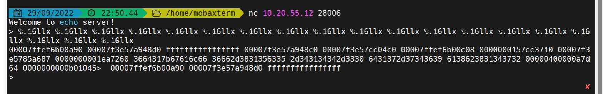
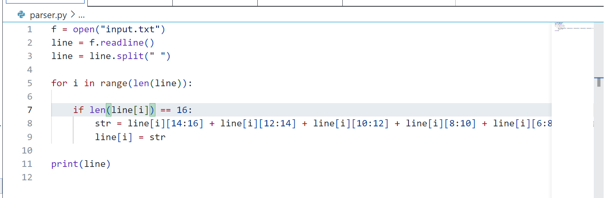
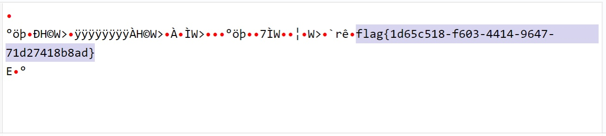
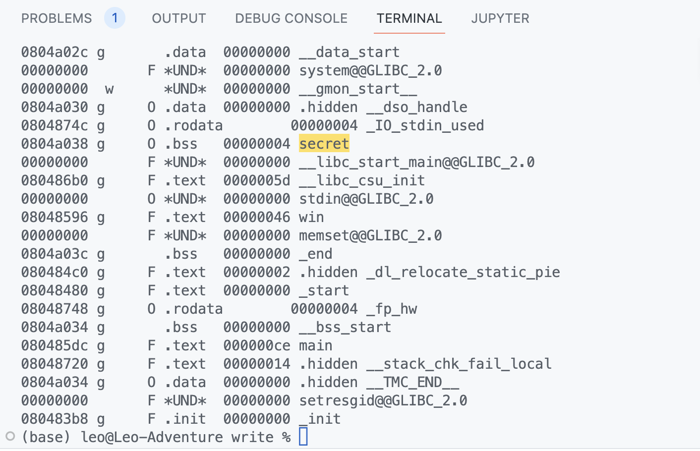
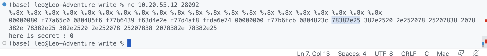
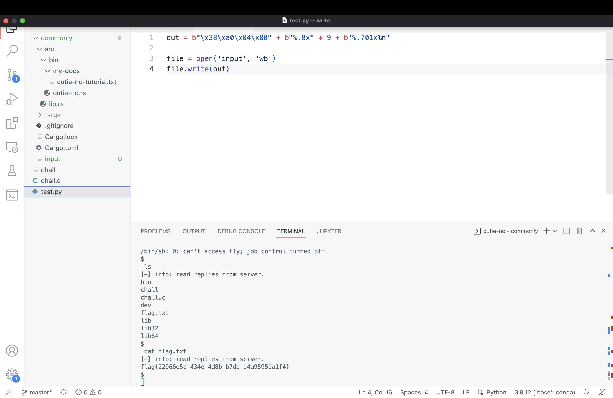

# Lab CTF 3

## SID：12012919

## Name: 廖铭骞

## 题目1  fmt

题目描述：Read the flag from stack!

### 分析

We can follow the steps 

### 步骤

1. Since the machine is 64-bit, so I use a string of `%.16llx`  to read the address of the stack.

   

2. Notice that the address in the server is little-endian, so I need to reverse the address to get the correct characters.



3. Use ASCII decoding and get the flag string.



### Flag

```
flag{1d65c518-f603-4414-9647-71d27418b8ad}
```

## 题目2 write

题目描述：If you are lucky enough, you would win.

### 分析

We can follow the steps 

### 步骤

1. use `objdump -x chall` to disassemble the executable file `chall`

2. get the `secret` address in the stack, which is `0x0804a038`

   

3. Input a string of `%.8x` to sniff the offset to the beginning of input, which is `11`

​			

4. Use the network connection program provided py CutieDeng https://github.com/CutieDeng/commonly, and file the input to server, I can get the flag.

   

### Flag

```
flag{22966e5c-434e-4d8b-b7dd-d4a95951a1f4}
```

